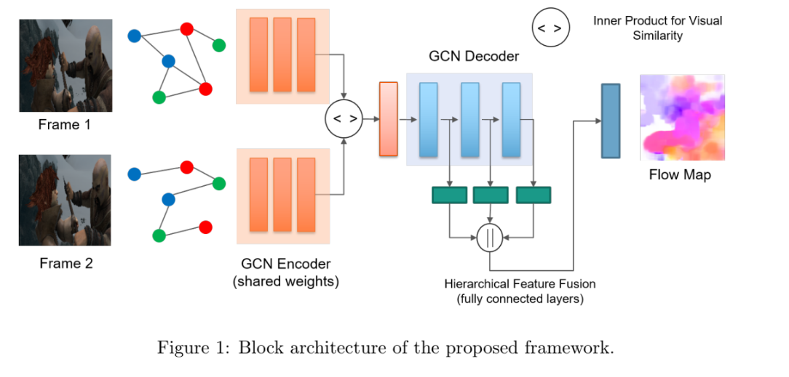

# optical_flow_GCN
**Optical Flow Estimation using GCN**

Optical flow is the task of estimation the per-pixel motion between two consecutive frames in a video. The goal here is to find the displacement of a sparse feature set or all image pixels to calculate the corresponding motion vectors. In this work, we investigate the optical flow prediction using GCN based framework to develop a robust spatio-temporal understanding of videos.

